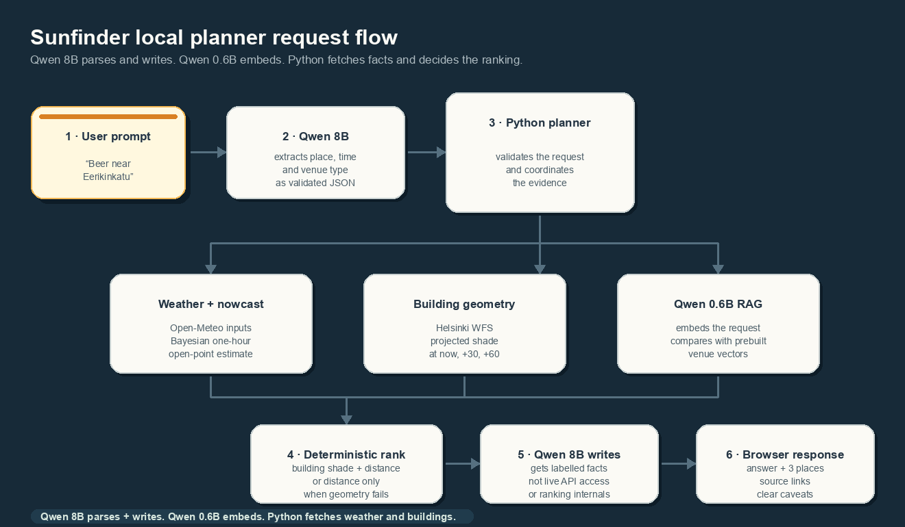

# Sunfinder Helsinki ☀️

> Find a sunny Helsinki terrace, park, or street corner before you leave.

[**Open the live map**](https://sunfinder-helsinki.onrender.com/) · Python · FastAPI · MapLibre · local LLM and RAG experiment

> The public map runs on Render's free tier. If it has been asleep, give it up to a minute to wake up.

Sunfinder combines three things that are easy to confuse:

| Question | What answers it | What it means |
| --- | --- | --- |
| Where could sun reach? | Building geometry + solar position | Clear sky potential at street level |
| Is direct sun likely right now? | City wide weather nowcast | A one hour estimate for an open point |
| Where should I go? | Local planner | Nearby venue notes plus deterministic ranking |

## Start here

The map starts at Bar Mendocino on Eerikinkatu. Pick a place, move through time, then refresh buildings for the part of Helsinki you can see.

- **Clear sky potential** shows where sun could reach if clouds open.
- **Direct sun estimate · beta** is a city wide hint about the next hour. It does not know what is happening above one specific street.
- **Building shadows** are calculated from the sun angle and visible building footprints.

The app is useful for planning, not surveying. Trees, small clouds, building heights, and terrace availability can still change the real answer.

## Run locally

```sh
python3 -m venv .venv
source .venv/bin/activate
python3 -m pip install -r requirements.txt
make run
```

Open [http://localhost:4173](http://localhost:4173).

Useful commands:

| Command | What it does |
| --- | --- |
| `make install` | Installs Python dependencies |
| `make run` | Starts the map locally |
| `make check` | Runs Python and browser checks |

<details>
<summary>Open the local app from another device with Tailscale</summary>

Keep the service private to your tailnet by binding it to the home PC's Tailscale IP:

```sh
tailscale ip -4
SUNFINDER_ASSISTANT_ENABLED=1 python3 -m uvicorn backend.main:app --host <TAILSCALE_IP> --port 4173
```

Then open `http://akselipc:4173` or `http://<TAILSCALE_IP>:4173` from your other Tailscale device. No router port forwarding is needed.

</details>

## Local outing planner

The optional **Plan a sunny outing** button is a local learning project. It stays off on the public Render deployment and does not need an API key.

On the computer that runs Ollama:

```sh
make assistant-setup
cp .env.example .env
make assistant-index
make assistant-run
```

Try a request like:

> Outdoor coffee near Kamppi tomorrow after work

The planner uses the selected map time and map centre as context. It does not train on your requests.

## How one planner request moves through the app



### Two models, different jobs

| Model | Runs when | Job |
| --- | --- | --- |
| `qwen3:8b` | Once to parse, then again to write when geometry is available | Extracts place, time, and venue type, then writes a short answer from facts |
| `qwen3-embedding:0.6b` | When building the index and when searching | Embeds venue notes once, embeds the new request, then supports cosine similarity search |

Python still owns the truth. It fetches weather, gets building geometry, projects shadows, calculates distance, and ranks venues. Qwen never fetches weather or decides a shadow result on its own.

The local RAG index is intentionally small:

```text
venue catalogue JSON
        ↓  qwen3-embedding:0.6b
saved vectors in .sunfinder/venue_index.json
        ↓  cosine similarity
relevant venue notes for the answer
```

There is no vector database yet because the catalogue has only 30 venues. A JSON vector index is faster to inspect and simpler to run locally.

<details>
<summary>Planner failure behaviour</summary>

If building geometry loads, Python ranks nearby places using projected building shade over now, +30 minutes, and +60 minutes, plus distance.

If building geometry fails, the app does **not** pretend a venue has a good sun score. It ranks the closest curated places by distance and says that shade could not be confirmed.

If the selected time is in the future, the map uses clear sky potential. Current weather only applies close to live time.

</details>

Rebuild the request-flow GIF after changing this architecture:

```sh
python3 scripts/build_request_flow_gif.py
```

## Direct sun estimate · beta

The beta estimate answers one narrow question:

> Can direct sun reach an open point in Helsinki during the next hour?

It is not a score for a specific terrace. The app takes estimates for now, +30 minutes, and +60 minutes, then averages them.

| It uses | It does not know |
| --- | --- |
| Cloud cover, low cloud, rain chance, weather code, direct radiation, sun altitude, season | A tree, a nearby wall, a small cloud over your street, terrace opening hours |
| One Open Meteo forecast point in central Helsinki | Whether every part of Helsinki is sunny |
| Bayesian uncertainty in the learned model weights | Full uncertainty in the weather forecast |

Current cloud cover and the next hour direct sun estimate can look different. For example, 96% cloud cover is the current sample. A 71% direct sun estimate is an average across current, +30 minute, and +60 minute forecast samples. Neither value belongs to a particular venue.

### Training snapshot

| Item | Value |
| --- | --- |
| Training data | Three years of Helsinki weather reanalysis |
| Dates | 2023-07-15 to 2026-07-13 |
| Target | Direct normal irradiance at least 120 W/m² during daylight |
| Rows | 13,257 daylight rows |
| Train and validation split | 8,838 and 4,419 chronological rows |
| Held out accuracy | 96.6% |
| Held out Brier score | 0.0258 |
| Average probability baseline | 60.5% accuracy and 0.2397 Brier score |

The data comes from [Open Meteo's historical weather API](https://open-meteo.com/en/docs/historical-weather-api). These scores are useful checks, not a promise about one Helsinki street. The target and direct radiation input come from the same reanalysis source, so a future version should use FMI observations and old forecast runs.

<details>
<summary>See the direct-sun calculation</summary>

The model makes a score called `z`, then sends it through the sigmoid curve:

```text
chance = 1 / (1 + exp(-z))

z = -2.8533
    - 2.6012 * total_cloud
    + 0.4081 * low_cloud
    - 1.2060 * total_cloud * low_cloud
    - 1.2874 * precipitation_signal
    + 0.0263 * rain_code
    + 25.3626 * direct_radiation_fraction
    + 3.4459 * sin(sun_altitude)
    - 0.3300 * sin(season)
    + 0.0689 * cos(season)
```

Cloud, low cloud, and rain chance are fractions from 0 to 1. The radiation fraction compares forecast direct radiation with a bright-sky value for the current sun height.

```text
direct_radiation_fraction = clamp(direct_radiation / max(25, 750 * sin(sun_altitude)))
season_sin = sin(2π * (day_of_year - 1) / 365.2425)
season_cos = cos(2π * (day_of_year - 1) / 365.2425)
```

For a late July example with 60% total cloud, 40% low cloud, 20% rain chance, a 35° sun, and 108 W/m² direct radiation, `z = 3.5729`. That gives a 97.3% model chance before the fog, rain, and heavy-cloud caps are applied.

</details>

<details>
<summary>See the Bayesian part</summary>

This is Bayesian logistic regression with a Laplace approximation, not an LLM.

```text
intercept ~ Normal(0.3130, 2.5²)
each feature weight ~ Normal(0, 2.5²)

weights | data ≈ Normal(MAP weights, inverse negative Hessian)
```

The trainer finds MAP weights with 10 Newton steps, then uses the inverse negative Hessian as an approximate posterior covariance. For a new weather row, that gives a middle chance plus a 90% model range.

```text
xᵀΣx = 0.0664
sd(z) = sqrt(0.0664) = 0.2577
z | data ≈ Normal(3.5729, 0.2577²)

90% chance range
= sigmoid(3.5729 ± 1.645 * 0.2577)
= 0.9589 to 0.9820
```

The live number averages now, +30 minutes, and +60 minutes. Those samples share model weights, so the app carries the shared covariance through the average instead of averaging three unrelated ranges.

Train again with the latest three years of data:

```sh
python3 scripts/train_direct_sun_model.py --days 1095
```

The next worthwhile upgrade is training against local [FMI solar radiation observations](https://en.ilmatieteenlaitos.fi/weather-observations) and validating against old forecast runs.

</details>

## Shadow geometry

For a building with height `H` and sun altitude `α`, the projected shadow length is:

```text
shadow length = H / tan(α)
```

The app caps shadows at 560 metres so very low sun does not make huge map polygons.

```python
shadow_length_m = min(560, building_height_m / tan(radians(sun_altitude_deg)))
shadow_bearing_deg = (sun_azimuth_deg + 180) % 360
```

Every footprint point is shifted by that distance and bearing. The original and shifted footprints become one convex hull polygon. A 20 metre building with a 30° sun casts a shadow of roughly 34.6 metres.

## Data and endpoints

| Data | Used for |
| --- | --- |
| Helsinki map tiles | Visible browser building footprints |
| Helsinki WFS | Python building fallback and planner geometry |
| Open Meteo | Current sky estimate and direct sun inputs |
| OpenStreetMap, Photon, and Nominatim | Map search and place suggestions |
| Local venue JSON | Seed data for RAG retrieval |

| Endpoint | Purpose |
| --- | --- |
| `GET /api/conditions` | Sun position, current sky, and direct sun nowcast |
| `GET /api/buildings` | Python building fallback for a map area |
| `GET /api/place-suggestions` | Debounced place suggestions while typing |
| `GET /api/places` | Submitted place or address search |
| `GET /api/sun-planner/status` | Local Ollama planner availability |
| `POST /api/sun-plans` | Local planner result |

## Repository guide

| Path | What lives there |
| --- | --- |
| `frontend/` | MapLibre interface, browser building tiles, and local shadow projection |
| `backend/main.py` | FastAPI routes, solar calculation, weather, and building fallback |
| `backend/nowcast.py` | Direct sun estimate at runtime |
| `backend/bayesian.py` | Small dependency-free Bayesian logistic regression implementation |
| `backend/sun_planner.py` | Ollama client, RAG index, and planner ranking helpers |
| `backend/venue_data/` | Curated venue notes for the local RAG experiment |
| `scripts/train_direct_sun_model.py` | Rebuilds the Bayesian nowcast artifact |
| `scripts/build_request_flow_gif.py` | Rebuilds the README animation |
