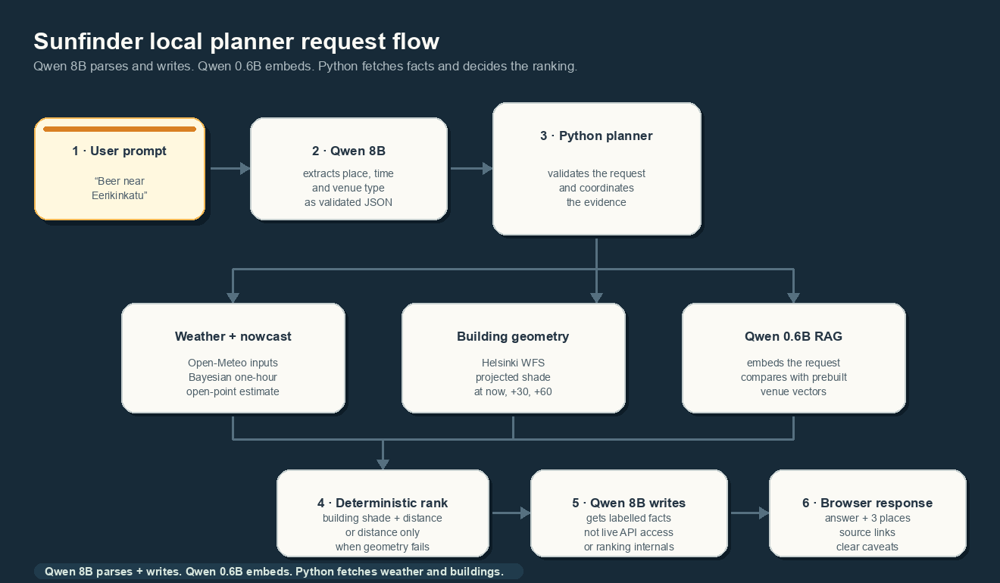

# Sunfinder Helsinki

Find a sunny Helsinki terrace, park, or street corner before you leave.

[Open the live map](https://sunfinder-helsinki.onrender.com/)

The public map is on Render's free tier. It can take about a minute to wake up after a quiet period.

## Use the map

1. Search for a place or use the map at Bar Mendocino on Eerikinkatu.
2. Pick a time with the time controls.
3. Move or zoom the map, then press **Load buildings here** to fetch what is on screen.
4. Turn on **Clear sky potential** to see where the sun could reach if clouds open.

Building shadows come from the current sun angle and the visible building footprints. The **Direct sun estimate** is a beta city wide estimate for an open point during the next hour. It is not a forecast for one terrace or street.

<details>
<summary>Run it on your computer</summary>

```sh
python3 -m venv .venv
source .venv/bin/activate
python3 -m pip install -r requirements.txt
make run
```

Open [http://localhost:4173](http://localhost:4173).

| Command | Purpose |
| --- | --- |
| `make install` | Install Python packages |
| `make run` | Start the map |
| `make check` | Run the Python and browser checks |

<details>
<summary>Open it from another Tailscale device</summary>

Find the home PC's Tailscale address:

```sh
tailscale ip -4
SUNFINDER_ASSISTANT_ENABLED=1 python3 -m uvicorn backend.main:app --host <TAILSCALE_IP> --port 4173
```

Open `http://akselipc:4173` or `http://<TAILSCALE_IP>:4173` from another device in the same tailnet. No router port forwarding is needed.

</details>

</details>

<details>
<summary>Use the local outing planner</summary>

**Plan a sunny outing** is optional and stays off on the public site. It runs on the computer with the local model. No API key is needed.

```sh
make assistant-setup
cp .env.example .env
make assistant-index
make assistant-run
```

Try something like:

> Outdoor coffee near Kamppi tomorrow after work

The planner reads the selected map time and map centre. It does not train on requests. Python still fetches weather, loads buildings, projects shadows, measures distance, and ranks venues. Qwen only extracts the request and turns the supplied facts into a short answer.

<details>
<summary>Check the planner model</summary>

The fixed Helsinki suite has 31 requests. It checks place, time, deadline, and venue type without calling the weather, building, or place APIs.

```sh
make assistant-benchmark BENCHMARK_ARGS='--repeat 3 --label ollama-warm'
```

The report goes to `.sunfinder/benchmarks/`. Ollama and vLLM both run without Qwen's thinking mode here, so the timing and accuracy numbers are comparable.

</details>

<details>
<summary>Try vLLM on a GPU</summary>

vLLM is another way to run the same local Qwen models. It does not train Qwen or replace the Python backend. It is useful for trying GPU serving and an OpenAI compatible local API.

Install it in its own environment on the GPU PC. Keep it out of `requirements.txt` because Render has no GPU.

```sh
python3 -m venv .vllm-venv
source .vllm-venv/bin/activate
python3 -m pip install --upgrade pip
python3 -m pip install vllm
make vllm-chat
```

The default chat model is Qwen's 4 bit `Qwen/Qwen3-8B-AWQ`. It is the same Qwen3 8B family as the Ollama model, stored with a different 4 bit format. It fits on a 16 GB GPU. The full BF16 model alone needs about 15.3 GB, so it leaves no space to answer requests.

Add this to `.env` when switching the app to vLLM:

```text
SUNFINDER_LLM_PROVIDER=vllm
SUNFINDER_VLLM_CHAT_BASE_URL=http://127.0.0.1:8000/v1
SUNFINDER_VLLM_EMBEDDING_BASE_URL=http://127.0.0.1:8001/v1
SUNFINDER_VLLM_API_KEY=sunfinder-local
SUNFINDER_VLLM_CHAT_MODEL=Qwen/Qwen3-8B-AWQ
SUNFINDER_VLLM_EMBEDDING_MODEL=Qwen/Qwen3-Embedding-0.6B
SUNFINDER_VLLM_CHAT_MAX_MODEL_LEN=8192
SUNFINDER_VLLM_CHAT_GPU_MEMORY_UTILIZATION=0.72
SUNFINDER_VLLM_EMBEDDING_MAX_MODEL_LEN=2048
SUNFINDER_VLLM_EMBEDDING_GPU_MEMORY_UTILIZATION=0.14
VLLM_USE_FLASHINFER_SAMPLER=0
```

Check the chat server before starting embeddings:

```sh
make assistant-benchmark BENCHMARK_ARGS='--repeat 3 --label vllm-awq-warm'
```

If the result looks good, open another terminal, activate `.vllm-venv`, and run `make vllm-embeddings`. Then, in the normal project environment, rebuild the venue index and start the app:

```sh
make assistant-index
make assistant-run
```

The chat server keeps 72% of the GPU and the embedding server keeps 14%. If the GPU cannot fit both, lower `SUNFINDER_VLLM_CHAT_GPU_MEMORY_UTILIZATION` first.

</details>

<details>
<summary>See how one request is handled</summary>



| Model | When it runs | Job |
| --- | --- | --- |
| `qwen3:8b` | When a request is sent and when an answer is written | Finds place, time, and venue type, then writes from supplied facts |
| `qwen3-embedding:0.6b` | When the index is built and when a request is searched | Turns venue notes and the request into vectors for similarity search |

The venue index is deliberately small:

```text
venue catalogue JSON
        ↓  qwen3-embedding:0.6b
saved vectors in .sunfinder/venue_index.json
        ↓  cosine similarity
relevant venue notes for the answer
```

There is no vector database because the catalogue has only 30 venues. A JSON file is easy to inspect and enough for this size.

If building geometry loads, Python checks projected shade now, in 30 minutes, and in 60 minutes, then combines that with distance. If geometry is missing, it only offers nearby curated places and says shade is unknown.

Rebuild the animation after changing this flow:

```sh
python3 scripts/build_request_flow_gif.py
```

</details>

</details>

<details>
<summary>Direct sun estimate and its maths</summary>

The beta estimate answers one question:

> Can direct sun reach an open point in Helsinki during the next hour?

It averages estimates for now, 30 minutes from now, and 60 minutes from now. It does not know about a tree, a nearby wall, a small local cloud, or a terrace opening time.

| It uses | It does not know |
| --- | --- |
| Cloud cover, low cloud, rain chance, weather code, direct radiation, sun height, and season | Trees, nearby walls, local clouds, or terrace opening times |
| One Open Meteo point in central Helsinki | Whether every part of Helsinki is sunny |
| Uncertainty in the learned weights | Full uncertainty in the weather forecast |

Current cloud cover and the next hour estimate can differ. For example, 96% cloud cover is one current sample. A 71% direct sun estimate averages the current, 30 minute, and 60 minute forecast samples.

<details>
<summary>Training snapshot</summary>

| Item | Value |
| --- | --- |
| Training data | Three years of Helsinki weather reanalysis |
| Dates | 2023-07-15 to 2026-07-13 |
| Target | Direct normal irradiance of at least 120 W/m² during daylight |
| Rows | 13,257 daylight rows |
| Train and validation split | 8,838 and 4,419 chronological rows |
| Held out accuracy | 96.6% |
| Held out Brier score | 0.0258 |
| Average probability baseline | 60.5% accuracy and 0.2397 Brier score |

The data comes from [Open Meteo's historical weather API](https://open-meteo.com/en/docs/historical-weather-api). These scores are checks, not a promise about one Helsinki street. A stronger version would train against local [FMI solar radiation observations](https://en.ilmatieteenlaitos.fi/weather-observations) and validate against old forecast runs.

</details>

<details>
<summary>See the direct sun calculation</summary>

The model makes a score called `z`, then puts it through the sigmoid curve:

```text
chance = 1 / (1 + exp(-z))

z = -2.8533
    - 2.6012 * total_cloud
    + 0.4081 * low_cloud
    - 1.2060 * total_cloud * low_cloud
    - 1.2874 * precipitation_signal
    + 0.0263 * rain_code
    + 25.3626 * direct_radiation_fraction
    + 3.4459 * sin(sun_altitude)
    - 0.3300 * sin(season)
    + 0.0689 * cos(season)
```

Cloud, low cloud, and rain chance are fractions from 0 to 1. The radiation fraction compares forecast direct radiation with a bright sky value for the current sun height.

```text
direct_radiation_fraction = clamp(direct_radiation / max(25, 750 * sin(sun_altitude)))
season_sin = sin(2π * (day_of_year - 1) / 365.2425)
season_cos = cos(2π * (day_of_year - 1) / 365.2425)
```

For a late July example with 60% total cloud, 40% low cloud, 20% rain chance, a 35° sun, and 108 W/m² direct radiation, `z = 3.5729`. That gives a 97.3% chance before the fog, rain, and heavy cloud caps.

</details>

<details>
<summary>See the Bayesian model</summary>

This is Bayesian logistic regression with a Laplace approximation. It is not an LLM.

```text
intercept ~ Normal(0.3130, 2.5²)
each feature weight ~ Normal(0, 2.5²)

weights | data ≈ Normal(MAP weights, inverse negative Hessian)
```

The trainer finds MAP weights with 10 Newton steps. The inverse negative Hessian gives an approximate posterior covariance. That gives a middle probability and a 90% model range for a new weather row.

```text
xᵀΣx = 0.0664
sd(z) = sqrt(0.0664) = 0.2577
z | data ≈ Normal(3.5729, 0.2577²)

90% chance range
= sigmoid(3.5729 ± 1.645 * 0.2577)
= 0.9589 to 0.9820
```

The live number combines now, 30 minutes from now, and 60 minutes from now while keeping the shared model uncertainty.

Train with the latest three years:

```sh
python3 scripts/train_direct_sun_model.py --days 1095
```

</details>

</details>

<details>
<summary>Shadow geometry</summary>

For a building with height `H` and sun altitude `α`:

```text
shadow length = H / tan(α)
```

The app caps a shadow at 560 metres so low sun does not cover half the map.

```python
shadow_length_m = min(560, building_height_m / tan(radians(sun_altitude_deg)))
shadow_bearing_deg = (sun_azimuth_deg + 180) % 360
```

Each footprint point moves by that distance and bearing. The original and moved footprints form a convex hull. A 20 metre building with a 30° sun gives a shadow of about 34.6 metres.

</details>

<details>
<summary>Data, API, and code map</summary>

| Data | Used for |
| --- | --- |
| Helsinki map tiles | Browser building footprints |
| Helsinki WFS | Python building fallback and planner geometry |
| Open Meteo | Current sky estimate and direct sun inputs |
| OpenStreetMap, Photon, and Nominatim | Place search and suggestions |
| Local venue JSON | Seed data for RAG retrieval |

| Endpoint | Purpose |
| --- | --- |
| `GET /api/conditions` | Sun position, current sky, and direct sun estimate |
| `GET /api/buildings` | Python building fallback for a map area |
| `GET /api/place-suggestions` | Suggestions while typing |
| `GET /api/places` | Submitted place or address search |
| `GET /api/sun-planner/status` | Local planner availability |
| `POST /api/sun-plans` | Local planner result |

| Path | What is there |
| --- | --- |
| `frontend/` | MapLibre interface, browser building tiles, and shadow projection |
| `backend/main.py` | FastAPI routes, solar calculation, weather, and building fallback |
| `backend/nowcast.py` | Direct sun estimate at runtime |
| `backend/bayesian.py` | Bayesian logistic regression |
| `backend/sun_planner.py` | Model client, RAG index, and planner ranking |
| `backend/venue_data/` | Curated venue notes |
| `scripts/train_direct_sun_model.py` | Rebuilds the nowcast model artifact |
| `scripts/build_request_flow_gif.py` | Rebuilds the README animation |

</details>
